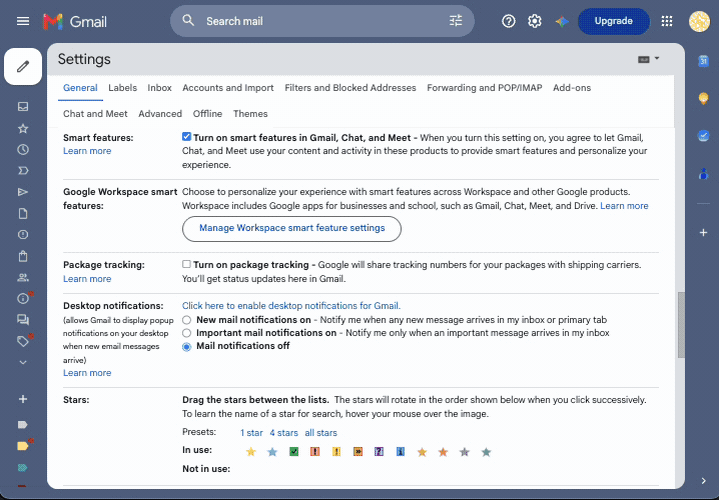
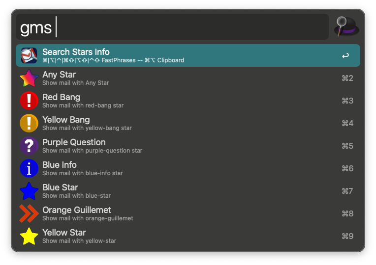
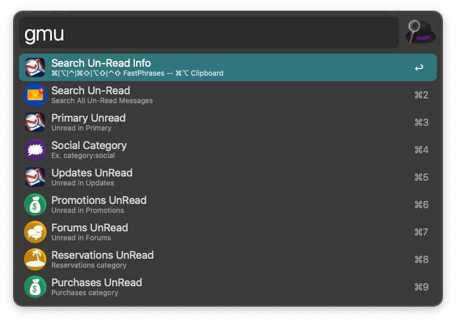
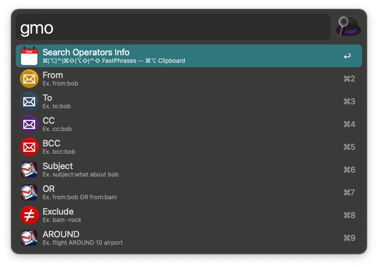
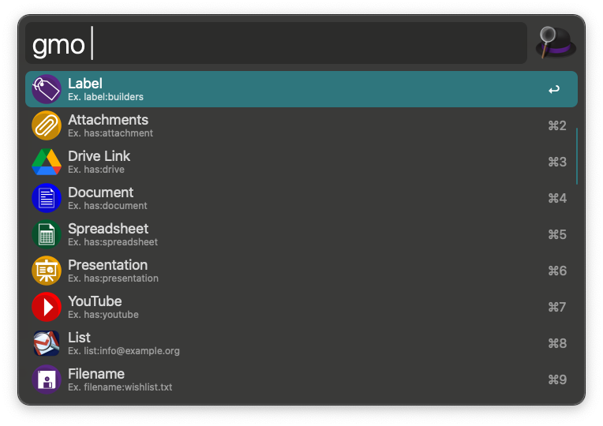
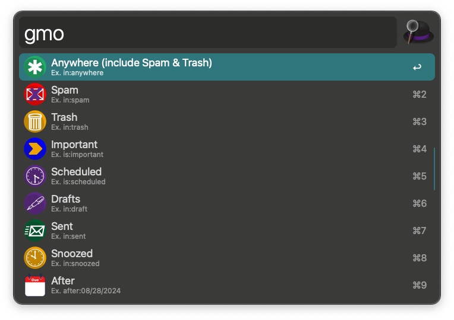

# Gmail Search Tools

[](https://github.com/cdouglasnet/Gmail-Search-Tools/actions/workflows/ci.yml?query=branch%3Amain)
[](https://github.com/cdouglasnet/Gmail-Search-Tools/actions/workflows/ci.yml?query=branch%3Adev)
[](https://github.com/cdouglasnet/Gmail-Search-Tools/releases)
[](requirements.txt)
[](https://www.alfredapp.com/)
[](LICENSE)

[](https://github.com/cdouglasnet/Gmail-Search-Tools/releases)
[](https://github.com/cdouglasnet/Gmail-Search-Tools/releases)

Alfred Workflow for quick access to Gmail Searching, Starred, Un-Read, Operators, and more.

🔍 Gmail-Search-Tools is designed to help you find that 🪡 one message you know is hiding in your mail somewhere buried among the other 🌎 300,000+ emails you have.


## 🔍 Keywords - (Customizable in Configuration)

- `gms` — Gmail Search Messages, Stars (Filterable) 🔍
- `gmss` — Gmail Search Messages, Stars + Argument ⭐️
- `gmu` — Gmail Un-Read Messages (Filterable) 📬
- `gmuu` — Search Un-Read Messages + Argument 📩
- `gmo` — Gmail Search Operators (Filterable) 🧰
- `gmoo` — Gmail Search Operators + Argument ⚙️
- `gmsettings` — Workflow settings/actions menu 🛠️



## 🚦 Usage

- `gms`<kbd>↩</kbd> Filterable List ➡️ default search. i.e. URL + has:red-bang
- `gmss` `{query}`<kbd>↩</kbd> Search + query ➡️ i.e. URL + has:red-bang + mySearchTerm(s)
- `gmu`<kbd>↩</kbd> Filterable List ➡️ default search Un-Read Messages. i.e. URL + is:unread
- `gmuu` `{query}`<kbd>↩</kbd> Un-Read + query ➡️ i.e. URL + is:unread + mySearchTerm(s)
- `gmo`<kbd>↩</kbd> Filterable List Search Operators ➡️ i.e. URL + has:attachment
- `gmoo` `{query}`<kbd>↩</kbd> Search Operators + query ➡️ i.e. URL + has:attachment + mySearchTerm(s)
- `gmsettings`<kbd>↩</kbd> Open settings menu ➡️ (Config, Diagnostic, Forum, GitHub).

## 🚦 Advanced Usage

- `gms`<kbd>⌘↩</kbd>||<kbd>⌥↩</kbd>||<kbd>⌃↩</kbd> ⭐️ + ⚡️Fast Phrase 1-3 ➡️ URL + has:red-bang + Fast Phrase (1-3)
- `gms`<kbd>⌘⇧↩</kbd>||<kbd>⌥⇧↩</kbd>||<kbd>⌃⇧↩</kbd> ⭐️ + ⚡️Fast Phrase 4-6 ➡️ URL + has:red-star + Fast Phrase (4-6)
- `gms`<kbd>⌘⌥↩</kbd> Stars ⭐️ + 📋 Clipboard ➡️ URL + has:red-star + Clipboard Text
-
- `gmu`<kbd>⌘↩</kbd>||<kbd>⌥↩</kbd>||<kbd>⌃↩</kbd> 📬 + ⚡️Fast Phrase 1-3 ➡️ URL + is:unread + Fast Phrase (1-3)
- `gmu`<kbd>⌘⇧↩</kbd>||<kbd>⌥⇧↩</kbd>||<kbd>⌃⇧↩</kbd> 📬 + ⚡️Fast Phrase 4-6 ➡️ URL + is:unread + Fast Phrase (4-6)
- `gmu`<kbd>⌘⌥↩</kbd> Un-Read 📬 + 📋 Clipboard ➡️ URL + is:unread + Clipboard Text
-
- `gmo`<kbd>⌘↩</kbd>||<kbd>⌥↩</kbd>||<kbd>⌃↩</kbd> 🧰 + ⚡️Fast Phrase 1-3 ➡️ URL + has:attachment + Fast Phrase (1-3)
- `gmo`<kbd>⌘⇧↩</kbd>||<kbd>⌥⇧↩</kbd>||<kbd>⌃⇧↩</kbd> 🧰 + ⚡️Fast Phrase 4-6 ➡️ URL + has:YouTube + Fast Phrase (4-6)
- `gmo`<kbd>⌘⌥↩</kbd> Operators 🧰 + 📋 Clipboard ➡️ URL + has:document + Clipboard Text

### `gms` Search Stars Faster ⭐
- **Search Gmail** — 🔍 Default search all messages
- **Unread** — 📬 Jumps to `gmu` search
- **Starred** — ⭐ yellow-star, red-star, blue-star, green-star, orange-star, purple-star,
  ❗️red-bang, yellow-bang, purple-question, blue-info, orange-guillemet, ✅ green-checkmark
- **Sent** — 📨 search sent messages
- **Drafts** — 📄 search draft messages
- **Important** — 🛟 search important messages
- **Spam** — 🍗 search spam messages
- **Trash** — 🗑️ search trash messages



### `gmu` Search Un-Read Faster 📬
- **Un-Read All** — all Un-Read messages in the main inbox
- **Un-Read Primary** — Un-Read inbox messages
- **Un-Read Updates** — Un-Read updates messages
- **Un-Read Promotions** - Un-Read promotions messages
- **Un-Read Forums** — Un-Read forums messages
- **Un-Read Reservations** - Un-Read reservations messages
- **Un-Read Purchases** — Un-Read purchases messages
- **Search Unread Starred** — unread starred messages



### `gmo` Search Operators 🧰
- **To/From** - 🕵️‍♀️ To: or From:
- **Subject** - 👀 Subject: (search within subject line)
- **Label** - 🏷️ label: (search within a specific label) i.e. label:myLabel
- **Attachment** - 💾 has:attachment (any file attachment)
- **Drive Links** - ☁️ has:drive (Google Drive links)
- **Video** - ▶️ has:YouTube (YouTube video links)
- **Document** - 📄 has:document (Google Docs, Word, PDF)
- **Spreadsheet** - 📊 has:spreadsheet (Excel, Numbers, Sheets)
- **Presentation** - 🖥️ has:presentation (PowerPoint, Keynote, Slides)





## ⚙️ Configuration

Customize keywords and Gmail account in Alfred's workflow preferences:

| Variable         | Default      | Description                                                 |
|------------------|--------------|-------------------------------------------------------------|
| `gms_key`        | `gms`        | Main Gmail search keyword                                   |
| `gmu_key`        | `gmu`        | Unread Gmail search keyword                                 |
| `gmo_key`        | `gmo`        | Gmail Search Operators keyword                              |
| `gmss_key`       | `gmss`       | Search Keyword (With Argument)                              |
| `gmuu_key`       | `gmuu`       | Un-Read keyword (With Argument)                             |
| `gmoo_key`       | `gmoo`       | Gmail Operators (With Argument)                             |
| `gmsettings_key` | `gmsettings` | Settings/actions menu keyword                               |
| `userNumber`     | `0`          | Gmail account index (0 = primary, 1 = second account, etc.) |

## 🔒 Security and Privacy
- 🛟 Privacy Safe (The Workflow - Not speaking for Gmail 😉)
- 🔗 Links sent to the browser (Defaults to Chrome)
- 🕵️‍♀️ No special permissions needed
- 🔐 Gmail Credentials are not used within the workflow at all! 
- ℹ️ Only Requirement – Browser needs to be signed in to your Gmail account.

## 📋 TODO

- Update the Alfred Forum URL in `src/info.plist` to the dedicated Gmail Search Tools forum thread once it is posted.
- Add Quck Switch support for multiple Gmail accounts in settings.
- Add support for multiple Gmail accounts.
- Add support for multiple Gmail labels via a label configuration dropdown setting.
- Add support to save a custom search using an Action Modifier Key.
- Add support for retrieving the saved custom search keyword.
- Add an Information Page for learning about gmail-search-tools and power searches

## ⚙️ Installation

1. Download `gmail-search-tools.alfredworkflow` from the [release page](https://github.com/cdouglasnet/Gmail-Search-Tools/releases)
2. Double-click to install in Alfred
3. Use `gms`, `gmu`, `gmo` to start searching Gmail or configure keywords in workflow preferences.

-----
## 🏗️ Building from Source

Requires Node.js and Python 3.9+.

```bash
# Install dependencies
npm run install-python-deps
npm install

# Run tests
npm test

# Build the workflow from `src/`
npm run build
```

The built workflow file will be at `dist/gmail-search-tools.alfredworkflow`.

### IDE setup

If your editor reports standard-library imports such as `argparse`, `json`, `os`,
or `urllib` as missing, select the project virtual environment as the Python
interpreter:

```text
.venv/bin/python3
```

The included `pyrightconfig.json` points Python language servers at that virtual
environment and adds `src/script` to the import path for tests and workflow
scripts.

## 🧑‍💻 Version Change Summary

### v0.0.0.1
- 🚀 Initial release with `gms`, `gmu`, `gmo`, `gmss`, `gmuu`, `gmoo`, and `gmsettings` keywords.
- 🔄 Added support for Gmail account switching.
- 🔎 Added support for Gmail search operators, starred, and Un-Read messages.
- ⚡ Added support for Gmail search fast phrases and clipboard text.

## ⚖️ License

MIT License — see [LICENSE](LICENSE).

Enjoy!
#### [CDoug](https://github.com/cdouglasnet)
