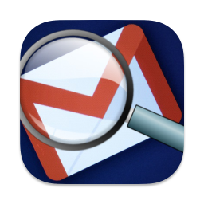
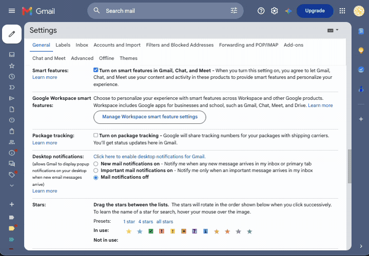
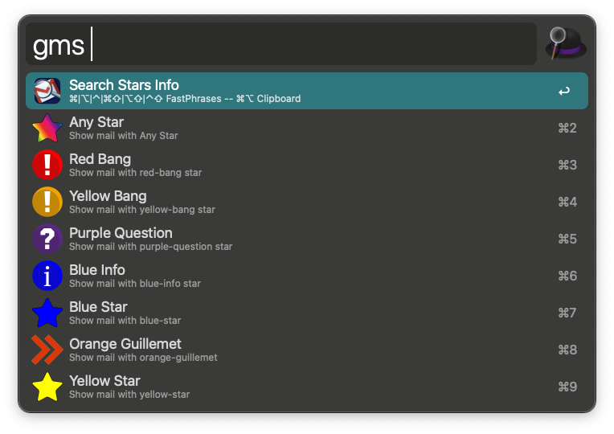
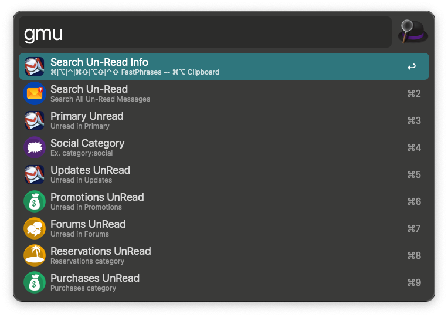
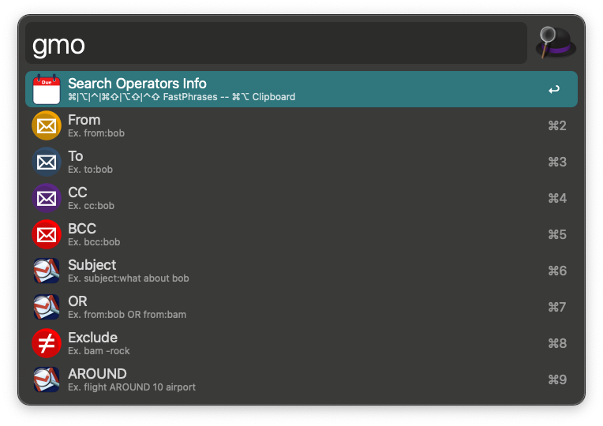
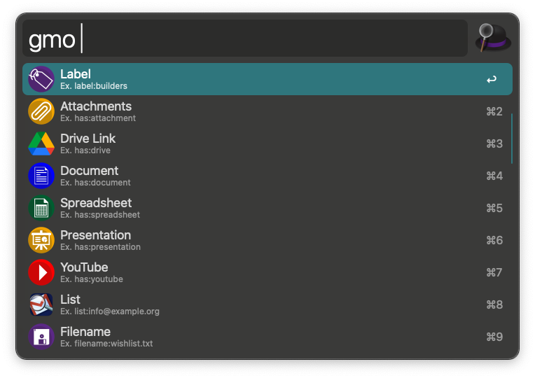
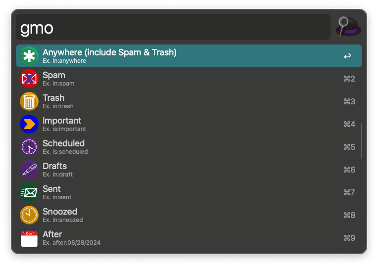

# Gmail Search Tools

[](https://github.com/cdouglasnet/Gmail-Search-Tools/actions/workflows/ci.yml?query=branch%3Amain)
[](https://github.com/cdouglasnet/Gmail-Search-Tools/actions/workflows/ci.yml?query=branch%3Abeta)
[](https://github.com/cdouglasnet/Gmail-Search-Tools/releases)
[](requirements.txt)
[](https://www.alfredapp.com/)
[](LICENSE)

[](https://github.com/cdouglasnet/Gmail-Search-Tools/releases)
[](https://github.com/cdouglasnet/Gmail-Search-Tools/releases)

Alfred Workflow for fast access to Gmail Power Searching, Starred, Un-Read, Operators, Labels, and more.

## 🔍 Power Search Gmail within the browser



## 🔍 Keywords - (Customizable in Configuration)

- `gms` — Gmail Search Messages, Stars (Filterable) 🔍
- `gmu` — Gmail Un-Read Messages (Filterable) 📬
- `gmo` — Gmail Search Operators (Filterable) 🧰
- `gml` — Gmail Search Labels (Filterable) 🏷️
- `gmsettings` — Workflow settings/actions menu 🛠️
- `gmuser` — Fast User Switching 📌
- `gmbrowser` — Select Target Browser 🌐



## Usage 🚦

- `gms`- Star Search - Filter List and select the wanted option <kbd>↩</kbd>
  - SubMenu has option to add a {Query} <kbd>↩</kbd>
  - Star search run in the browser - i.e. URL + has:red-bang + {Query}
- `gmu` - Un-Read - Filter List and select the wanted option <kbd>↩</kbd>
  - SubMenu has option to add a {Query} <kbd>↩</kbd>
  - Un-Read search run in the browser - i.e. URL + is:unread
- `gmo` - Search Operators - Filter List and select the wanted option <kbd>↩</kbd>
  - SubMenu has option to add a {Query} <kbd>↩</kbd>
  - Operator search run in the browser - i.e. URL + has:attachment
- `gml` - Labels - Filter List and select the wanted option <kbd>↩</kbd>
  - SubMenu has option to add a {Query} <kbd>↩</kbd>
  - Label search run in the browser - i.e. URL + label:myLabel
- `gmsettings` - Open settings menu option <kbd>↩</kbd>
  - (Config, Diagnostic, Browser, Labels, Forum, GitHub, etc).
- `gmuser` - select which User account to switch to <kbd>↩</kbd>
  - userNumber is updated. (don't have to open config)
- `gmbrowser` - Select Target Browser <kbd>↩</kbd>
  - target_browser is updated. (don't have to open config).

## Advanced Usage 🚦

You can use fast phrases and clipboard like this:

- `gms` <kbd>⌘</kbd><kbd>↩</kbd> -or- <kbd>⌥</kbd><kbd>↩</kbd> -or- <kbd>⌃</kbd><kbd>↩</kbd>  ⭐️ + ⚡️Fast Phrase 1-3
  - URL + has:red-bang + Fast Phrase (1-3)


- `gms` <kbd>⌘⇧</kbd><kbd>↩</kbd> -or- <kbd>⌥⇧</kbd><kbd>↩</kbd> -or- <kbd>⌃⇧</kbd><kbd>↩</kbd>  ⭐️ + ⚡️Fast Phrase 4-6
  - URL + has:red-star + Fast Phrase (4-6)


- `gms` <kbd>⌘⌥</kbd><kbd>↩</kbd>  ⭐️ + 📋 Clipboard
  - URL + has:red-star + Clipboard Text

### ⚡️ Fast Phrases
- Customize - Fast Phrases in workflow configuration - For when you search for the same thing all the time
- Up to 6 fast phrases (Displays text for fast Phrases when modifier key(s) pressed)

### 📋 Clipboard Inject
- Use a main keyword gms, gmu, gmo, gml+ <kbd>⌘⌥</kbd><kbd>↩</kbd>
- Clipboard will be added to search (preview search on 2nd menu)

## Trigger as Universal Action ➡️
With selected text you can use the main functions via **Universal Action** as follows

- `gmss` — Gmail Search Messages, Stars + Argument ⭐️
- `gmuu` — Search Un-Read Messages + Argument 📩
- `gmoo` — Gmail Search Operators + Argument ⚙️
- `gmll` — Gmail Search Labels + Argument 🏷️

### Universal Action Usage ➡️
- `gmss` `{query}` Select Star Option <kbd>↩</kbd>
  - Search + query ➡️ i.e. URL + has:red-bang + mySearchTerm(s)
- `gmuu` `{query}` Select Un-Read Option <kbd>↩</kbd>
  - Search + query ➡️ i.e. URL + is:unread + mySearchTerm(s)
- `gmoo` `{query}` Select Operator Option <kbd>↩</kbd>
  - Search + query ➡️ i.e. URL + has:attachment + mySearchTerm(s)
- `gmll` `{query}` Select Label Option <kbd>↩</kbd>
  - Search + query ➡️ i.e. URL + label:myLabel + mySearchTerm(s)


### `gms` Search Stars Faster ⭐
- **Search Gmail** — Default search all messages 🔍
- **Unread** — Jumps to `gmu` search 📬
- **Starred** — ⭐ yellow-star, red-star, blue-star, green-star, orange-star, purple-star,
  ❗️red-bang, yellow-bang, purple-question, blue-info, orange-guillemet, ✅ green-checkmark
- **Sent** — search sent messages 📨
- **Drafts** — search draft messages 📄
- **Important** — search important messages 🛟
- **Spam** — search spam messages 🍗
- **Trash** — search trash messages 🗑️



### `gmu` Search Un-Read Faster 📬
- **Un-Read All** — all Un-Read messages in the main inbox
- **Un-Read Primary** — Un-Read inbox messages
- **Un-Read Updates** — Un-Read updates messages
- **Un-Read Promotions** - Un-Read promotions messages
- **Un-Read Forums** — Un-Read forums messages
- **Un-Read Reservations** - Un-Read reservations messages
- **Un-Read Purchases** — Un-Read purchases messages
- **Search Unread Starred** — unread starred messages



### `gmo` Search Operators 🧰
- **To/From** - To: or From: 🕵️‍♀️
- **Subject** - Subject: (search within subject line) 👀
- **Label** - label: (search within a specific label) i.e. label:myLabel 🏷️
- **Attachment** - has:attachment (any file attachment) 💾
- **Drive Links** - has:drive (Google Drive links) ☁️
- **Video** - has:YouTube (YouTube video links) ▶️
- **Document** - has:document (Google Docs, Word, PDF) 📄
- **Spreadsheet** - has:spreadsheet (Excel, Numbers, Sheets) 📊
- **Presentation** - has:presentation (PowerPoint, Keynote, Slides) 🖥️





### `gml` Search Labels 🏷️
- Requires user-defined labels in Configuration. (you can export labels via extension... See Below)
- **User Labels** — 🏷️ Search within user-defined labels
- **User Labels + Query** — 🏷️ Search within user-defined labels with a specific query

## 📌 Requirements
- Gmail or Google Workspace Account 📧
- Browser needs to be signed in to your Gmail account(s) 🌐
- Alfred 5+ with Power Pack 🔋
- A Supported Browser: Safari, Webkit, Orion, Google Chrome, Chromium, Opera, Vivaldi, Brave Browser, Microsoft Edge

## ⚙️ Configuration

Customize keywords and Gmail account in Alfred's workflow preferences:

| Variable         | Default         | Description                                                 |
|------------------|-----------------|-------------------------------------------------------------|
| `userNumber`     | `0`             | Gmail account index (0 = primary, 1 = second account, etc.) |
| `target_browser` | `Google Chrome` | Dropdown of available browsers                              |
| `gms_key`        | `gms`           | Main Gmail search keyword                                   |
| `gmu_key`        | `gmu`           | Unread Gmail search keyword                                 |
| `gmo_key`        | `gmo`           | Gmail Search Operators keyword                              |
| `gmss_key`       | `gmss`          | Search Keyword (With Argument)                              |
| `gmuu_key`       | `gmuu`          | Un-Read keyword (With Argument)                             |
| `gmoo_key`       | `gmoo`          | Gmail Operators (With Argument)                             |
| `gml_key`        | `gml`           | User Labels keyword                                         |
| `gmll_key`       | `gmll`          | User Labels + Query keyword                                 |
| `gmuser_key`     | `gmuser`        | Quick Access to User Switching keyword                      |
| `gmsettings_key` | `gmsettings`    | Settings/actions menu keyword                               |
| `gmbrowser_key`  | `gmbrowser`     | Browser selection keyword                                   |
| `email_0`        | `acct0@...`     | Primary Gmail account email address (for fast Switching)    |
| `email_1-9`      | `acct1@...`     | Additional Gmail account email addresses (Fast Switching)   |

## 🔒 Security and Privacy
- 🛟 Privacy Safe (The Workflow - Not speaking for Gmail 😉)
- 🔗 Links sent to the browser (Defaults to Chrome)
- 🕵️‍♀️ No special permissions needed
- 🔐 Gmail Credentials are not used within the workflow at all! 
- ℹ️ Only Requirement – Browser needs to be signed in to your Gmail account(s).

## 🏷️ Exporting Labels (Not Required)

This is a simple guide to export your Gmail labels for use in the workflow so that you don't have to type them. (😀 Emoji are supported)
- Details on External Extension **Labels Manager For Gmail** (Not Required for Workflow) https://www.goldyarora.com/guides/labels-manager
- Follow these steps to install the extension, Export Labels, and
- Open **Google Sheets** and create a **new Sheet**
- **Extensions > Add-Ons > Get Add-Ons**
- Search for **"Labels Manager for Gmail"** and install the extension.
- **Grant Permissions 🔐 (required for extension to work)**
- Close Extension Manager ❎
- **Extensions > Labels Manager for Gmail > Setup Wizard > Create Label Sheets**
- Goto tab **"3. Export Labels"** ⤵️
- **Extensions > Labels Manager for Gmail > 3. Export Labels > Export Labels (light)**
- Extension will populate sheet with labels...
- Select labels starting after **"UNREAD"** in first column only. **<Copy>** 📋
- open **Gmail-Search-Tools** config use Alfred: gmsettings > **Config**
- Paste labels into **"Comma Separated Labels"** Field
- Labels_Config.png
- Add comma between each entry
- Save Configuration at bottom right

Use gml and gmll keywords to search within user-defined labels 😎
-
- **Use `gml` and `gmll` keywords** to search within user-defined labels.

## 📋 TODO

- Update the Alfred Forum URL in `src/info.plist` to the dedicated Gmail Search Tools forum thread once it is posted.
- Add support for multiple Gmail accounts.
- Add support to save a custom search using an Action Modifier Key.
- Add support for retrieving the saved custom search keyword.
- Add an Information Page for learning about gmail-search-tools and power searches

## ⚙️ Installation

1. Download `gmail-search-tools.alfredworkflow` from the [release page](https://github.com/cdouglasnet/Gmail-Search-Tools/releases)
2. Double-click to install in Alfred
3. Use `gms`, `gmu`, `gmo` to start searching Gmail or configure keywords in workflow preferences.

-----
## 🏗️ Building from Source

Requires Node.js and Python 3.9+.

```bash
# Install dependencies
npm run install-python-deps
npm install

# Run tests
npm test

# Build the workflow from `src/`
npm run build
```

The built workflow file will be at `dist/gmail-search-tools.alfredworkflow`.

### IDE setup

If your editor reports standard-library imports such as `argparse`, `json`, `os`,
or `urllib` as missing, select the project virtual environment as the Python
interpreter:

```text
.venv/bin/python3
```

The included `pyrightconfig.json` points Python language servers at that virtual
environment and adds `src/script` to the import path for tests and workflow
scripts.

## 🧑‍💻 Version Change Summary

### v0.0.0.1
- 🚀 Initial release with `gms`, `gmu`, `gmo`, `gmss`, `gmuu`, `gmoo`, and `gmsettings` keywords.
- 🔄 Added support for Gmail account switching.
- 🔎 Added support for Gmail search operators, starred, and Un-Read messages.
- ⚡ Added support for Gmail search fast phrases and clipboard text.

### v0.0.0.2
- 🏷️ Support for Searching User Labels. `gml`, `gmll`
- 🔢 Email Account Switching Support. `gmuser`

### v0.0.0.3
- 🌐 Browser Selection Support. `target_browser` Under Configure Workflow.
- 🧑‍💻 Support for Safari, Webkit, Orion, Google Chrome, Chromium, Opera, Vivaldi, Brave Browser, Microsoft Edge
- ⚡ Quick change browser via `gmbrowser` keyword
- 🔗 Link to change browser from `gmsettings` menu

## ⚖️ License

MIT License — see [LICENSE](LICENSE).

Enjoy!
#### [CDoug](https://github.com/cdouglasnet)
